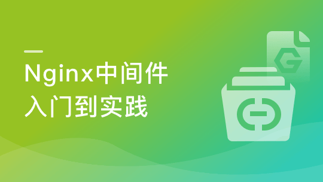

# Nginx入门到实践-Nginx中间件应用+搭建Webserver架构

> 简介：

> 价格：266.00

> [官方链接：https://coding.imooc.com/class/121.html](https://coding.imooc.com/class/121.html)

> [阿里网盘：](https://www.aliyundrive.com/s/vugJC4wdw4S)

> [百度网盘：]()

> [夸克网盘：]()
