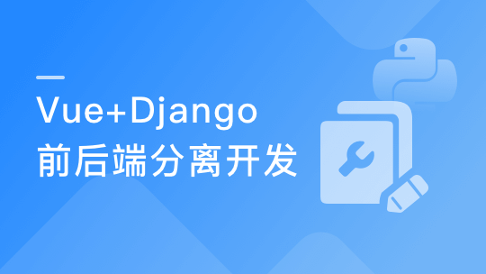

# Python前后端分离开发Vue+Django REST framework实战

> 简介：

> 价格：388.00

> [官方链接：https://coding.imooc.com/class/131.html](https://coding.imooc.com/class/131.html)

> [阿里网盘：](https://www.aliyundrive.com/s/oSkiX18ZosR)

> [百度网盘：]()

> [夸克网盘：]()
