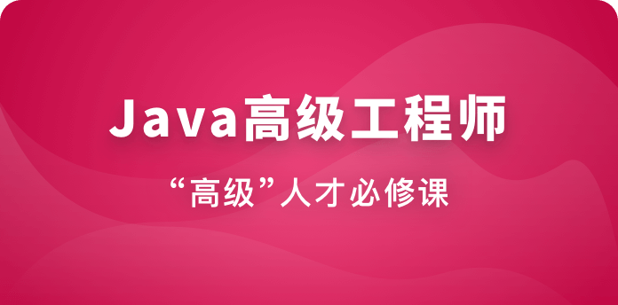

# Java高级工程师

> 简介： 通过一个复杂大项目的贯穿，掌握必备主流技术栈，提升技术的广度与深度，实现从初中级到高级工程师的跨越！

> 价格：2488.00

> [官方链接：https://class.imooc.com/sale/javasenior](https://class.imooc.com/sale/javasenior)

> [阿里网盘：]()

> [百度网盘：]()

> [夸克网盘：]()
