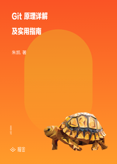

# Git 原理详解及实用指南

> 简介：让你不仅用上、更用明白的 Git 实用指南

> 讲师：扔物线

> 价格：¥29.9

> [官方链接：https://juejin.cn/book/6844733697996881928?utm_source=course_list](https://juejin.cn/book/6844733697996881928?utm_source=course_list)

> [阿里网盘：]()

> [百度网盘：]()

> [夸克网盘：]()
