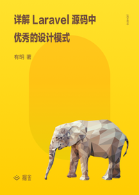

# 详解 Laravel 源码中优秀的设计模式

> 简介：深入浅出地带你领略 Laravel 框架的设计模式美学，一本你不可或缺的设计模式范本

> 讲师：有明

> 价格：¥19.9

> [官方链接：https://juejin.cn/book/6844733703516585997?utm_source=course_list](https://juejin.cn/book/6844733703516585997?utm_source=course_list)

> [阿里网盘：]()

> [百度网盘：]()

> [夸克网盘：]()
