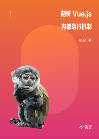

# 剖析 Vue.js 内部运行机制

> 简介：把原理抽象为小 Demo，以一种对新手友好的方式带领读者漫游 Vue.js 的世界

> 讲师：染陌同学

> 价格：¥9.9

> [官方链接：https://juejin.cn/book/6844733705089449991?utm_source=course_list](https://juejin.cn/book/6844733705089449991?utm_source=course_list)

> [阿里网盘：]()

> [百度网盘：]()

> [夸克网盘：]()
