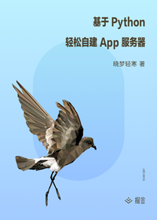

# 基于 Python 轻松自建 App 服务器

> 简介：手把手教你一步步构建一套易扩展、成体系的 App 后端服务器

> 讲师：晓梦轻寒

> 价格：¥19.9

> [官方链接：https://juejin.cn/book/6844733718335062030?utm_source=course_list](https://juejin.cn/book/6844733718335062030?utm_source=course_list)

> [阿里网盘：]()

> [百度网盘：]()

> [夸克网盘：]()
