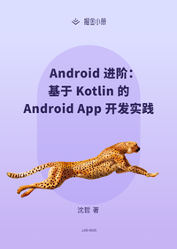

# Android 进阶：基于 Kotlin 的 Android App 开发实践

> 简介：快速上手 Kotlin 独有新特性，整合 Android 常用框架及 MVVM 思想进行 App 开发

> 讲师：Tony沈哲

> 价格：¥19.9

> [官方链接：https://juejin.cn/book/6844733722583891976?utm_source=course_list](https://juejin.cn/book/6844733722583891976?utm_source=course_list)

> [阿里网盘：]()

> [百度网盘：]()

> [夸克网盘：]()
