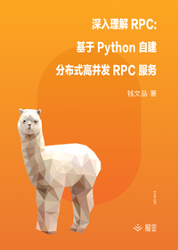

# 深入理解 RPC : 基于 Python 自建分布式高并发 RPC 服务

> 简介：通过「造轮子」自建 Python RPC 服务，深入理解分布式高并发原理与实践

> 讲师：老錢

> 价格：¥19.9

> [官方链接：https://juejin.cn/book/6844733722936377351?utm_source=course_list](https://juejin.cn/book/6844733722936377351?utm_source=course_list)

> [阿里网盘：]()

> [百度网盘：]()

> [夸克网盘：]()
