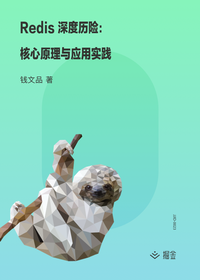

# Redis 深度历险：核心原理与应用实践

> 简介：大型互联网企业 Redis 实践总结，结合实际问题深入讲解 Redis 内部机制

> 讲师：老錢

> 价格：¥29.9

> [官方链接：https://juejin.cn/book/6844733724618129422?utm_source=course_list](https://juejin.cn/book/6844733724618129422?utm_source=course_list)

> [阿里网盘：]()

> [百度网盘：]()

> [夸克网盘：]()
