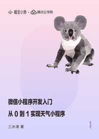

# 微信小程序开发入门：从 0 到 1 实现天气小程序

> 简介：从基础到实战，从开发环境搭建到开发、调试、上线，打通小程序开发全流程

> 讲师：三水清

> 价格：¥9.9

> [官方链接：https://juejin.cn/book/6844733743266005006?utm_source=course_list](https://juejin.cn/book/6844733743266005006?utm_source=course_list)

> [阿里网盘：]()

> [百度网盘：]()

> [夸克网盘：]()
