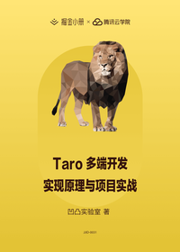

# Taro 多端开发实现原理与项目实战

> 简介：剖析 Taro 多端开发框架的实现原理，并通过电商核心的项目实战，帮助开发者快速上手多端项目。

> 讲师：凹凸实验室

> 价格：¥9.9

> [官方链接：https://juejin.cn/book/6844733744830480397?utm_source=course_list](https://juejin.cn/book/6844733744830480397?utm_source=course_list)

> [阿里网盘：]()

> [百度网盘：]()

> [夸克网盘：]()
