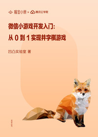

# 微信小游戏开发入门：从 0 到 1 实现井字棋游戏

> 简介：构建自己的第一个微信小游戏，让你的社交和游戏创意变为现实

> 讲师：凹凸实验室

> 价格：¥9.9

> [官方链接：https://juejin.cn/book/6844733747904905229?utm_source=course_list](https://juejin.cn/book/6844733747904905229?utm_source=course_list)

> [阿里网盘：]()

> [百度网盘：]()

> [夸克网盘：]()
