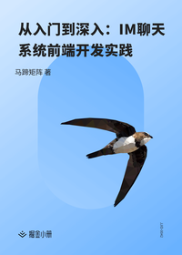

# 从入门到深入：IM聊天系统前端开发实践

> 简介：IM聊天为案例，系统性讲解前端核心知识点

> 讲师：马蹄矩阵

> 价格：¥19.9

> [官方链接：https://juejin.cn/book/6844733781945876488?utm_source=course_list](https://juejin.cn/book/6844733781945876488?utm_source=course_list)

> [阿里网盘：]()

> [百度网盘：]()

> [夸克网盘：]()
