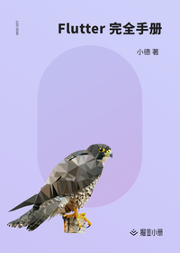

# Flutter 完全手册

> 简介：从开发到底层原理，手把手带你入门进阶 Flutter

> 讲师：小德_Kurt

> 价格：¥29.9

> [官方链接：https://juejin.cn/book/6844733786626719757?utm_source=course_list](https://juejin.cn/book/6844733786626719757?utm_source=course_list)

> [阿里网盘：]()

> [百度网盘：]()

> [夸克网盘：]()
