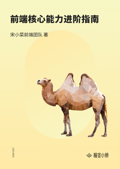

# 优秀的前端团队是如何炼成的

> 简介：以宋小菜前端的成长历史，结合实际案例探讨前端团队从游击队到正规军如何从 0 到 1，工程师的价值如何最大化，技术栈基建规划如何有效落地，新人同学如何快速成长，枯燥机械式工作中如何突破天花板，帮助工程师更好把握自己职业脉络，做最优技术决策，实现体系化突破成长。

> 讲师：前端早早聊

> 价格：¥18

> [官方链接：https://juejin.cn/book/6844733800379842574?utm_source=course_list](https://juejin.cn/book/6844733800379842574?utm_source=course_list)

> [阿里网盘：]()

> [百度网盘：]()

> [夸克网盘：]()
