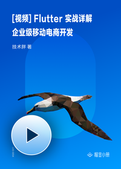

# [视频] Flutter 实战详解：企业级移动电商开发

> 简介：手把手教你一起用 Flutter 开发一个移动电商 App

> 讲师：技术胖

> 价格：¥368

> [官方链接：https://juejin.cn/book/6844733803647205384?utm_source=course_list](https://juejin.cn/book/6844733803647205384?utm_source=course_list)

> [阿里网盘：]()

> [百度网盘：]()

> [夸克网盘：]()
