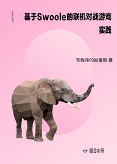

# 基于 Swoole 的联机对战游戏实践

> 简介：仅仅游戏玩得好已经不能满足了，干脆用Swoole来写一个游戏吧！

> 讲师：写程序的赵童鞋

> 价格：¥19.9

> [官方链接：https://juejin.cn/book/6844733804590940168?utm_source=course_list](https://juejin.cn/book/6844733804590940168?utm_source=course_list)

> [阿里网盘：]()

> [百度网盘：]()

> [夸克网盘：]()
