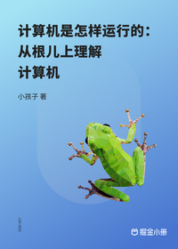

# 计算机是怎样运行的：从根儿上理解计算机

> 讲师：小孩子4919

> 价格：¥29.9

> [官方链接：https://juejin.cn/book/6844733810282594312?utm_source=course_list](https://juejin.cn/book/6844733810282594312?utm_source=course_list)

> [阿里网盘：]()

> [百度网盘：]()

> [夸克网盘：]()
