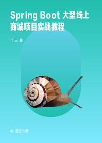

# Spring Boot 大型线上商城项目实战教程

> 简介：Spring Boot 技术栈真实应用案例

> 讲师：程序员十三

> 价格：¥89

> [官方链接：https://juejin.cn/book/6844733814074245133?utm_source=course_list](https://juejin.cn/book/6844733814074245133?utm_source=course_list)

> [阿里网盘：]()

> [百度网盘：]()

> [夸克网盘：]()
