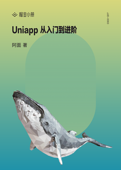

# Uniapp 从入门到进阶

> 简介：从基础到实战，详细讲解跨平台应用开发的方方面面，包含 Uniapp 开发常用知识点，基础 api，前端交互、组件封装，后端 Nodejs 开发、前后端联调和调优部署，是一套非常全面的综合课程。

> 讲师：阿面

> 价格：¥29.9

> [官方链接：https://juejin.cn/book/6844733817438076936?utm_source=course_list](https://juejin.cn/book/6844733817438076936?utm_source=course_list)

> [阿里网盘：]()

> [百度网盘：]()

> [夸克网盘：]()
