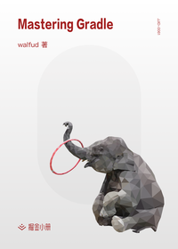

# Mastering Gradle

> 简介：这是一本能拉开你与别人 Gradle 差距的书。 从工程实践角度出发, 一方面讲述 Gradle 的核心用法, 另一方面讲述其背后的原理. 相信看完我们精心准备的系列文章, 读者再也不用死记硬背 Build Script 到底有哪些配置?, 也不会为 Gradle 到底是怎么执行的? 这些问题而苦恼, 而是有种 拨云见日, 原来如此, 不过如此 的顿悟感.

> 讲师：walfud

> 价格：¥29.9

> [官方链接：https://juejin.cn/book/6844733819363262472?utm_source=course_list](https://juejin.cn/book/6844733819363262472?utm_source=course_list)

> [阿里网盘：]()

> [百度网盘：]()

> [夸克网盘：]()
