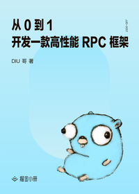

# 从 0 到 1 开发一款高性能 RPC 框架

> 简介：本小册主要从一个开发者的角度，从技术选型到编码实现，从 0 到 1去实现一款高性能 rpc 框架，主要技术点包括 client 和 server 通讯、超时机制实现、协议的制定、传输层 transport 实现、编解码、序列化、连接池、服务发现、负载均衡、拦截器、分布式链路追踪、认证鉴权、组件化、插件体系、框架性能优化等。

> 讲师：DIU哥

> 价格：¥29.9

> [官方链接：https://juejin.cn/book/6844733826422276103?utm_source=course_list](https://juejin.cn/book/6844733826422276103?utm_source=course_list)

> [阿里网盘：]()

> [百度网盘：]()

> [夸克网盘：]()
