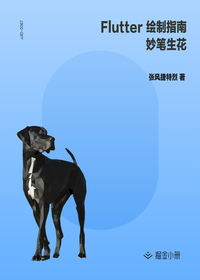

# Flutter 绘制指南 - 妙笔生花

> 简介：带你见证 Flutter 的绘制之美，全面解析绘制相关的知识。数学和程序的碰撞，擦出创造的火花。

> 讲师：张风捷特烈

> 价格：¥3.28

> [官方链接：https://juejin.cn/book/6844733827265331214?utm_source=course_list](https://juejin.cn/book/6844733827265331214?utm_source=course_list)

> [阿里网盘：]()

> [百度网盘：]()

> [夸克网盘：]()
