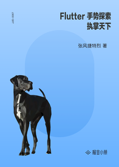

# Flutter 手势探索 - 执掌天下

> 简介：Flutter 手势探索，用你的手指，掌控着整个屏幕世界 /home/codespace

> 讲师：张风捷特烈

> 价格：¥3.5

> [官方链接：https://juejin.cn/book/6896378716427911181?utm_source=course_list](https://juejin.cn/book/6896378716427911181?utm_source=course_list)

> [阿里网盘：]()

> [百度网盘：]()

> [夸克网盘：]()
