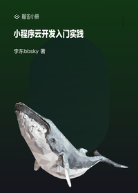

# 小程序云开发入门到实践

> 简介：零基础系统掌握小程序的开发和腾讯云云开发的知识，并开发出一个完整的小程序项目。

> 讲师：李东bbsky

> 价格：¥0.1

> [官方链接：https://juejin.cn/book/6897486502482149376?utm_source=course_list](https://juejin.cn/book/6897486502482149376?utm_source=course_list)

> [阿里网盘：]()

> [百度网盘：]()

> [夸克网盘：]()
