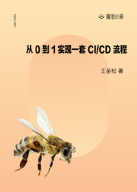

# 从 0 到 1 实现一套 CI/CD 流程

> 简介：一步步实现一套基于容器化技术的 CI/CD 流程，助力研发提效

> 讲师：王圣松

> 价格：¥29.9

> [官方链接：https://juejin.cn/book/6897616008173846543?utm_source=course_list](https://juejin.cn/book/6897616008173846543?utm_source=course_list)

> [阿里网盘：]()

> [百度网盘：]()

> [夸克网盘：]()
