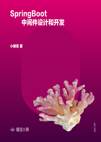

# SpringBoot 中间件设计和开发

> 简介：代理反射、扰动函数、字节码插桩、类代理注册，把技术与场景结合学习中间件开发技术！

> 讲师：小傅哥

> 价格：¥29.9

> [官方链接：https://juejin.cn/book/6940996508632219689?utm_source=course_list](https://juejin.cn/book/6940996508632219689?utm_source=course_list)

> [阿里网盘：]()

> [百度网盘：]()

> [夸克网盘：]()
