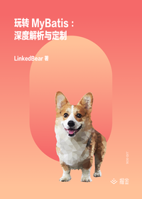

# 玩转 MyBatis：深度解析与定制

> 简介：深度解析 MyBatis 的内部机制和原理，带你分析 MyBatis 的各个特性的底层设计，并且在 MyBatis 的基础之上做二次封装。

> 讲师：LinkedBear

> 价格：¥49.9

> [官方链接：https://juejin.cn/book/6944917557878980638?utm_source=course_list](https://juejin.cn/book/6944917557878980638?utm_source=course_list)

> [阿里网盘：]()

> [百度网盘：]()

> [夸克网盘：]()
