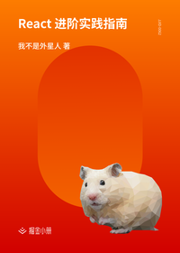

# React 进阶实践指南

> 简介：彻底弄懂 React 基础和高阶用法，结合实践 Demo，告别技术瓶颈期，实现进阶~

> 讲师：我不是外星人

> 价格：¥49.9

> [官方链接：https://juejin.cn/book/6945998773818490884?utm_source=course_list](https://juejin.cn/book/6945998773818490884?utm_source=course_list)

> [阿里网盘：]()

> [百度网盘：]()

> [夸克网盘：]()
