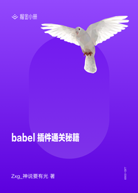

# Babel 插件通关秘籍

> 简介：深入探究 babel 编译原理，学完可以写任何 babel 插件。

> 讲师：zxg_神说要有光

> 价格：¥49.9

> [官方链接：https://juejin.cn/book/6946117847848321055?utm_source=course_list](https://juejin.cn/book/6946117847848321055?utm_source=course_list)

> [阿里网盘：]()

> [百度网盘：]()

> [夸克网盘：]()
