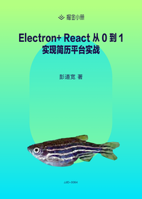

# Electron + React 从 0 到 1 实现简历平台实战

> 简介：本小册从一个开发者角度，讲述技术选型到编码实现，点亮 Electron、TS 等技术点，逐步深入React开发，从0到1实现一款轻巧适用的简历平台桌面应用。

> 讲师：彭道宽

> 价格：¥29.9

> [官方链接：https://juejin.cn/book/6950646725295996940?utm_source=course_list](https://juejin.cn/book/6950646725295996940?utm_source=course_list)

> [阿里网盘：]()

> [百度网盘：]()

> [夸克网盘：]()
