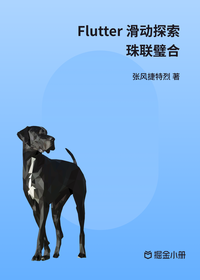

# Flutter 滑动探索 - 珠联璧合

> 简介：从源码入手，带你深入探索 Flutter 滑动体系

> 讲师：张风捷特烈

> 价格：¥3.5

> [官方链接：https://juejin.cn/book/6984685333312962573?utm_source=course_list](https://juejin.cn/book/6984685333312962573?utm_source=course_list)

> [阿里网盘：]()

> [百度网盘：]()

> [夸克网盘：]()
