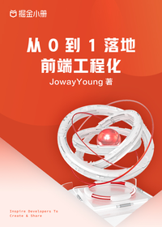

# 从 0 到 1 落地前端工程化

> 简介：6 大模块 + 21 项技能，构建前端工程化知识体系

> 讲师：JowayYoung

> 价格：¥29.9

> [官方链接：https://juejin.cn/book/7034689774719860739?utm_source=course_list](https://juejin.cn/book/7034689774719860739?utm_source=course_list)

> [阿里网盘：]()

> [百度网盘：]()

> [夸克网盘：]()
