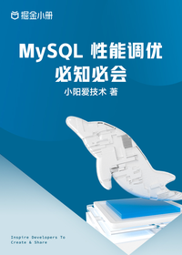

# MySQL 性能调优必知必会

> 简介：深入解读底层原理，搞懂 MySQL 性能优化内幕

> 讲师：小阳爱技术

> 价格：¥29.9

> [官方链接：https://juejin.cn/book/7040451582978162719?utm_source=course_list](https://juejin.cn/book/7040451582978162719?utm_source=course_list)

> [阿里网盘：]()

> [百度网盘：]()

> [夸克网盘：]()
