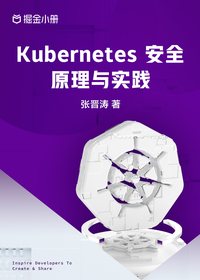

# Kubernetes 安全原理与实践

> 简介：理论加实践，彻底搞定 Kubernetes 安全

> 讲师：张晋涛

> 价格：¥29.9

> [官方链接：https://juejin.cn/book/7044052687779790880?utm_source=course_list](https://juejin.cn/book/7044052687779790880?utm_source=course_list)

> [阿里网盘：]()

> [百度网盘：]()

> [夸克网盘：]()
