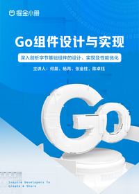

# Go 组件设计与实现

> 简介：4 位字节跳动研发工程师，带你深入剖析字节基础组件的设计、实现及性能优化

> 讲师：掘金小册

> 价格：¥69

> [官方链接：https://juejin.cn/book/7046282096435789835?utm_source=course_list](https://juejin.cn/book/7046282096435789835?utm_source=course_list)

> [阿里网盘：]()

> [百度网盘：]()

> [夸克网盘：]()
