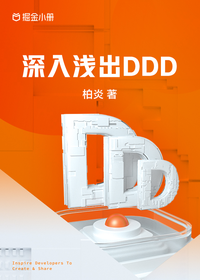

# 深入浅出 DDD

> 简介：从基础概念到落地实践，带你领略自顶向下的业务驱动架构，击碎老旧代码、复杂业务维护困难的噩梦。

> 讲师：柏炎

> 价格：¥29.9

> [官方链接：https://juejin.cn/book/7049273428938850307?utm_source=course_list](https://juejin.cn/book/7049273428938850307?utm_source=course_list)

> [阿里网盘：]()

> [百度网盘：]()

> [夸克网盘：]()
