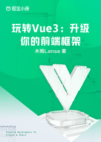

# 玩转Vue3：升级你的前端框架

> 简介：剖析新特性+升级实战+项目全家桶+性能优化，全面解析Vue3

> 讲师：木雨Lanse

> 价格：¥29.9

> [官方链接：https://juejin.cn/book/7051153166443741188?utm_source=course_list](https://juejin.cn/book/7051153166443741188?utm_source=course_list)

> [阿里网盘：]()

> [百度网盘：]()

> [夸克网盘：]()
