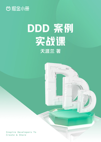

# DDD 案例实战课

> 简介：从零开始，手把手教你实现企业级的 DDD 应用程序

> 讲师：天涯兰

> 价格：¥49.9

> [官方链接：https://juejin.cn/book/7056372655913435172?utm_source=course_list](https://juejin.cn/book/7056372655913435172?utm_source=course_list)

> [阿里网盘：]()

> [百度网盘：]()

> [夸克网盘：]()
