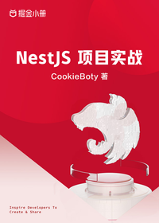

# NestJS 项目实战

> 简介：从 0 搭建网关系统，玩转 NestJS 开发

> 讲师：CookieBoty

> 价格：¥29.9

> [官方链接：https://juejin.cn/book/7065201654273933316?utm_source=course_list](https://juejin.cn/book/7065201654273933316?utm_source=course_list)

> [阿里网盘：]()

> [百度网盘：]()

> [夸克网盘：]()
