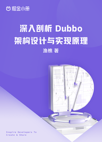

# 深入剖析 Dubbo 架构设计和实现原理

> 简介：架构设计思想 + 底层源码细节 + 功能扩展实践，系统化深入理解Dubbo

> 讲师：渔樵爱买基

> 价格：¥39.9

> [官方链接：https://juejin.cn/book/7069596046602534919?utm_source=course_list](https://juejin.cn/book/7069596046602534919?utm_source=course_list)

> [阿里网盘：]()

> [百度网盘：]()

> [夸克网盘：]()
