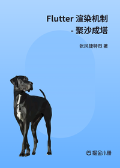

# Flutter 渲染机制 - 聚沙成塔

> 简介：全面探索 Flutter 框架源码，助你攀登九层之台，一览顶上风采 /home/codespace

> 讲师：张风捷特烈

> 价格：¥3.5

> [官方链接：https://juejin.cn/book/7084139149673889805?utm_source=course_list](https://juejin.cn/book/7084139149673889805?utm_source=course_list)

> [阿里网盘：]()

> [百度网盘：]()

> [夸克网盘：]()
