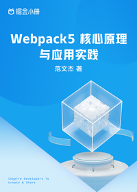

# Webpack5 核心原理与应用实践

> 简介：由浅入深，从场景化工程搭建技巧；到构建与应用性能优化技巧；再到 Loader、Plugin 组件开发；最终落地到源码级剖析 Webpack 执行原理。

> 讲师：范文杰

> 价格：¥59.9

> [官方链接：https://juejin.cn/book/7115598540721618944?utm_source=course_list](https://juejin.cn/book/7115598540721618944?utm_source=course_list)

> [阿里网盘：]()

> [百度网盘：]()

> [夸克网盘：]()
