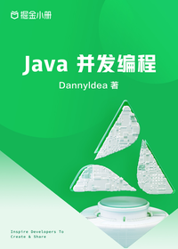

# Java 并发编程

> 简介：理论+实战，带你深入浅出Java并发编程

> 讲师：DannyIdea

> 价格：¥39.9

> [官方链接：https://juejin.cn/book/7116420171471781903?utm_source=course_list](https://juejin.cn/book/7116420171471781903?utm_source=course_list)

> [阿里网盘：]()

> [百度网盘：]()

> [夸克网盘：]()
