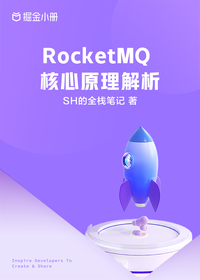

# RocketMQ 核心原理解析

> 简介：生活场景驱动，由浅入深带你搞懂 RocketMQ

> 讲师：SH的全栈笔记

> 价格：¥39.9

> [官方链接：https://juejin.cn/book/7138560870908428320?utm_source=course_list](https://juejin.cn/book/7138560870908428320?utm_source=course_list)

> [阿里网盘：]()

> [百度网盘：]()

> [夸克网盘：]()
