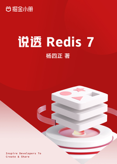

# 说透 Redis 7

> 简介：核心原理剖析+源码解读+实践应用，全方位带你吃透 Redis 7

> 讲师：杨四正

> 价格：¥69.9

> [官方链接：https://juejin.cn/book/7144917657089736743?utm_source=course_list](https://juejin.cn/book/7144917657089736743?utm_source=course_list)

> [阿里网盘：]()

> [百度网盘：]()

> [夸克网盘：]()
