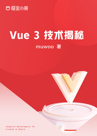

# Vue 3 技术揭秘

> 简介：渐进式揭秘 Vue 3 源码的设计过程和架构思想

> 讲师：muwoo

> 价格：¥39.9

> [官方链接：https://juejin.cn/book/7146465352120008743?utm_source=course_list](https://juejin.cn/book/7146465352120008743?utm_source=course_list)

> [阿里网盘：]()

> [百度网盘：]()

> [夸克网盘：]()
