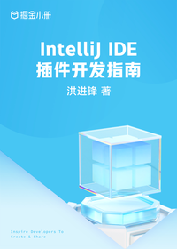

# IntelliJ IDE 插件开发指南

> 简介：搭建+开发+售卖，你的第一本商业化 IntelliJ IDE 插件开发 CookBook

> 讲师：洪进锋

> 价格：¥29.9

> [官方链接：https://juejin.cn/book/7146874802144280611?utm_source=course_list](https://juejin.cn/book/7146874802144280611?utm_source=course_list)

> [阿里网盘：]()

> [百度网盘：]()

> [夸克网盘：]()
