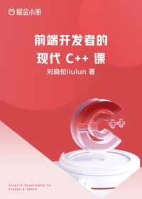

# 前端开发者的现代 C++ 课

> 简介：专门为前端开发者“定制”的现代 C++ 编程指南

> 讲师：刘晓伦liulun

> 价格：¥39.9

> [官方链接：https://juejin.cn/book/7174425017277972513?utm_source=course_list](https://juejin.cn/book/7174425017277972513?utm_source=course_list)

> [阿里网盘：]()

> [百度网盘：]()

> [夸克网盘：]()
